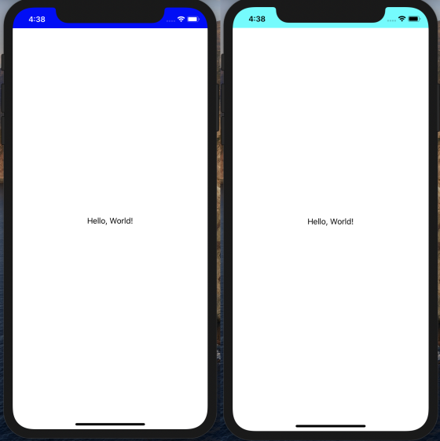

# StatusBarColorKit
<p align="left">
    
    
    <a href="https://twitter.com/Fire_At_Will_">
        
    </a>
</p>
StatusBarColorKit lets you easily set the background color and style of the status bar in SwiftUI! 🌈



## Usage

In your `SceneDelegate.swift` file, replace the existing `UIHostingController` with `StatusBarColorManager` and wrap your `ContentView` in an `AnyView`:

```swift
import StatusBarColorKit

class SceneDelegate: UIResponder, UIWindowSceneDelegate {

    func scene(_ scene: UIScene, willConnectTo session: UISceneSession, options connectionOptions: UIScene.ConnectionOptions) {
        // Create the SwiftUI view that provides the window contents.
        let contentView = ContentView()

        // Use a StatusBarColorManager as window root view controller.
        if let windowScene = scene as? UIWindowScene {
            let window = UIWindow(windowScene: windowScene)
            window.rootViewController = StatusBarColorManager(rootView: AnyView(contentView))
            self.window = window
            window.makeKeyAndVisible()
        }
    }
    // ...
}
```

Then, set the status bar's style and background color:

```swift
StatusBarColorManager.statusBarBackgroundColor = .systemBlue
StatusBarColorManager.statusBarStyle = .darkContent
```

And that's it!

## Installation
StatusBarColorKit is a Swift package, to use it in your project, add this to your `Package.swift` file:

```swift
let package = Package(
    ...
    dependencies: [
        .package(url: "https://github.com/fire-at-will/StatusBarColorKit", from: "0.1.0")
    ],
    ...
)
```

## Contributions
PRs are always welcome! :)
